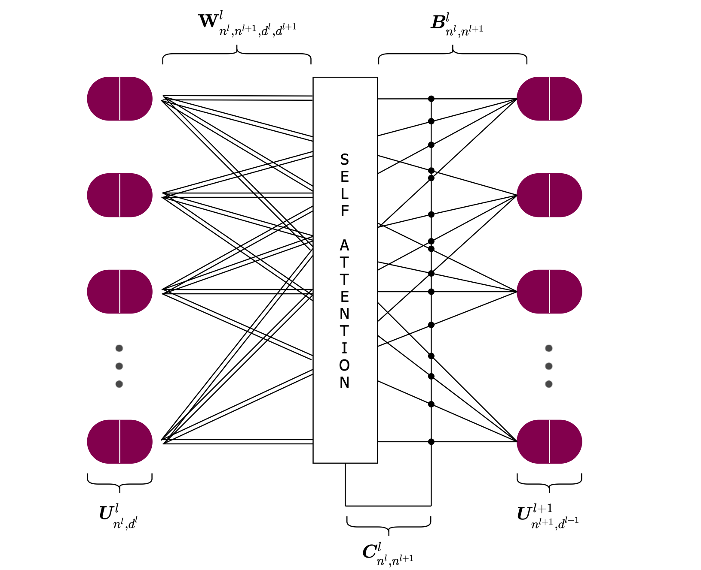
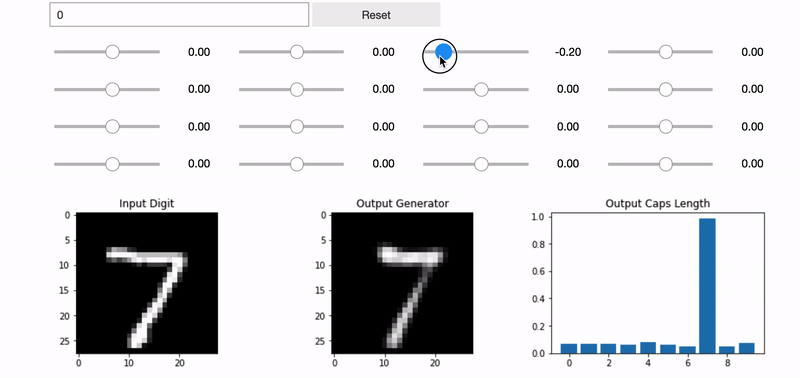

[](https://arxiv.org/abs/2101.12491)
[](https://paperswithcode.com/sota/image-classification-on-smallnorb?p=efficient-capsnet-capsule-network-with-self)
[](https://paperswithcode.com/sota/image-classification-on-mnist?p=efficient-capsnet-capsule-network-with-self)
[](https://opensource.org/licenses/Apache-2.0)


<h1 align="center"> ~ Efficient-CapsNet ~ </h1>
Are you tired of over inflated and overused convolutional neural networks? You're right! It's time for <strong>CAPSULES</strong> :)<br>

This repository has been made for two primarly reasons:

 - open source the code (most of) developed during our "first-stage" research on capsules, summarized by the forthcoming article "Efficient-CapsNet: Capsule Network with Self-Attention Routing". The repository let you play with Efficient-CapsNet and let you set the base for your own experiments.
 - be an hub and a headlight in the cyberspace to spread to the machine learning comunity the intrinsic potential and value of capsule. However, albeit remarkable results achieved by capsule networks, we're fully aware that they're only limited to toy datasets. Nevertheless, there's a lot to make us think that with the right effort and collaboration of the scientific community, capsule based networks could really make a difference in the long run. For now, feel free to dive in our work :))
 
 <p align="center">
  
</p>

# 1.0 Getting Started

## 1.1 Installation

Python3 and Tensorflow 2.x are required and should be installed on the host machine following the [official guide](https://www.tensorflow.org/install). Good luck with it!

1. Clone this repository
   ```bash
   git clone https://github.com/EscVM/Efficient-CapsNet.git
   ```
2. Install the required packages
   ```bash
   pip3 install -r requirements.txt
   ```
Peek inside the requirements file if you have everything already installed. Most of the dependencies are common libraries.

# 2.0 Efficient-CapsNet Notebooks
The repository provides two starting notebooks to make you confortable with our architecture. They all have the information and explanations to let you dive further in new research and experiments. 
The [first](https://github.com/EscVM/Efficient-CapsNet/blob/main/efficient_capsnet_test.ipynb) one let you test Efficient-CapsNet over three different datasets. The repository is provided with some of the weights derived by our own experiments.
On the other hand, the [second](https://github.com/EscVM/Efficient-CapsNet/blob/main/efficient_capsnet_train.ipynb) one let you train the network from scratch. It's a very lightweight network so you don't need "Deep Mind" TPUs arsenal to train it. However, even if a GP-GPU is not compulsory, it's strongly suggested (No GPU, no deep learning, no party).

# 3.0 Original CapsNet Notebooks
It goes without saying that our work has been inspiered by Geoffrey Hinton and his article "[Dynamic Routing Between Capsules](https://arxiv.org/abs/1710.09829)". It's really an honor to build on his idea. Nevertheless, when we did our first steps in the capsule world, we were pretty disappointed in finding that all repositories/implementations were ultimately wrong in some aspects. So, we implemented everything from scratch, carefully following the original Sara's [repository](https://github.com/Sarasra/models/tree/master/research/capsules). However, our implementation, besides beeing written for the new TensorFlow 2 version, is much more easier and practical to use. Sara's one is really overcomplicated and too mazy that you can lost pretty easily.

As for the previous section we provide two notebooks, [one](https://github.com/EscVM/Efficient-CapsNet/blob/main/original_capsnet_test.ipynb) for testing (weights have been derived from Sara's repository) and [one](https://github.com/EscVM/Efficient-CapsNet/blob/main/original_capsnet_train.ipynb) for training. 

Nevertheless, there's a really negative note (at least for us:)); as all other repositories that you can find on the web, also our one is not capable to achieve the scores reported in their [paper](https://arxiv.org/abs/1710.09829). We really did our best, but there is no way to make the network achieve a score greater than 99.64% on MNIST. Exactly for this reason, weights provided in this repository are derived from their repository. Anyway, it's Geoffrey so we can excuse him.


# 4.0 Capsules Dimensions Perturbation Notebook
The network is trained with a reconstruction regularizer that is simply a fully connected network trained in conjuction with the main one. So, we can use it to visualize the inner capsules reppresentations. In particular, we should expect that a dimension of a digit capsule should learn to span the space of variations in the way digits of that class are instantiated. We can see what the individual dimensions represent by making use of the decoder network and injecting some noise to one of the dimensions of the main digit capsule layer that is predicting the class of the input.

So, we coded a practical notebook in which you can dynamically tweak whichever dimension you want of the capsule that is making the prediction (longest one).

Finally, if you don't have the necessary resources (GP-GPU holy grail) you can still try this interesting notebook out on 
<a href="https://colab.research.google.com/drive/1hEnjNiTRVkQczIvfIxskfoOTligNRjQG?usp=sharing"></a>.
 <p align="center">
  
 </p>
 
# Citation
Use this bibtex if you enjoyed this repository and you want to cite it:

```
@article{mazzia2021efficient,
  title={Efficient-CapsNet: capsule network with self-attention routing},
  author={Mazzia, Vittorio and Salvetti, Francesco and Chiaberge, Marcello},
  year={2021},
  journal={Scientific reports},
  publisher={Nature Publishing Group},
  volume={11}
}
```
# <p>轻量级肩关节植入物z制造商分类模型：融合NCP 和高效胶囊网络 </p> <p> Shoulder implant Manufacturers classification model: Ensembling NCP and Efficient-Capsule Networks</p>


在该项目中，我们将高效胶囊网络与NCP神经网络结合，对模型进行轻量化同时引入类不平衡损失函数来改善模型性能，成功开发了一种低成本、高精度的肩关节植入物分类算法。具体来说，我们将高效胶囊网络的解码器部分参数由144万优化至57万，同时将模型分类精度提升至约85%左右。该算法具有在医疗设备领域广泛应用的潜力。且该算法的通用性使得它可以被应用于其他领域或问题，如医疗影像识别和产品质量检测等。


# 项目背景


# 数据集
下载地址：https://download.csdn.net/download/m0_70420861/88873763?spm=1001.2014.3001.5501
## 胶囊网络
胶囊网络具有诸多良好优点，其中最重要的，契合与医学图像分割的便是其向量的表示，可以很好的建模局部-整体关系。同时由于这种向量的表达，使得胶囊网络仅需在训练过程中找到合适的胶囊从而生成有用的预测即可，而不是像卷积神经网络那样去“记住”目标的特征形式。这也是为什么胶囊网络更适合训练较少的数据，当数据集过大反而性能下降的原因。


<h4>高效胶囊网络</h4>


## NCP


<p></p>


## 实验


## 类平衡损失函数


## 可视化


# 项目总结


提出了一种新的肩关节植入物分类方法，实现了高效准确的分类的目标。将所提出的算法与经典卷积神经网络模型和其他文献中最优算法进行比较，不仅在分类精度上得到了很大的提升，且大大减少了参数量和模型训练时间。高效精确的分类可以帮助外科医生快速确定植入物制造商，缩短治疗进程。相对于其他相关文献中的方法，本文提出的方法准确率和计算成本都取得了更好的表现。由于数据集太小，获得的准确的预测结果需要人工增加数据集才能实现，当人工增加的图片过多，远多于原始图片时，预测效果反而不好，所以扩增真实数据集是未来迫切需要完成的工作。此外，在线分类功能对迫切需要进行手术时提供了更加方便快捷的方式，未来可以注重在线分类系统的搭建。
